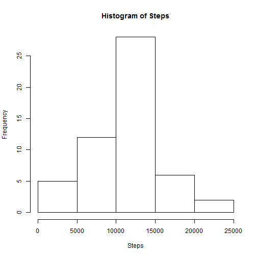

#Loading and preprocessing the data

```r
library(dplyr)
```

```
## 
## Attaching package: 'dplyr'
## 
## The following object is masked from 'package:stats':
## 
##     filter
## 
## The following objects are masked from 'package:base':
## 
##     intersect, setdiff, setequal, union
```

```r
data <- read.csv("activity.csv")
data$date <- as.Date(data$date)
```

#What is mean total number of steps taken per day?

###Total number of steps taken each day (ignoring NA):

```r
xdata <- summarise(group_by(data, date), sum(steps))
names(xdata) <- c("Date", "Steps")
with(xdata, hist(Steps))
```

 

###The mean of the total number of steps taken each day:

```r
mean(xdata$Steps, na.rm=TRUE)
```

```
## [1] 10766.19
```

###The median of the total number of steps taken each day:

```r
median(xdata$Steps, na.rm=TRUE)
```

```
## [1] 10765
```

#What is the average daily activity pattern?

###Time series plot of the 5-minute interval and the average number of steps taken, averaged across all days:

```r
ydata <- summarise(group_by(data, interval), mean(steps, na.rm=TRUE))
names(ydata) <- c("Interval", "Steps")
plot(ydata, type="l")
```

 

###The 5-minute interval that contains the maximum number of steps on average:

```r
ydata[which.max(ydata$Steps),]
```

```
## Source: local data frame [1 x 2]
## 
##   Interval    Steps
## 1      835 206.1698
```

#Imputing missing values

###The total number of rows that are missing values in the dataset:

```r
sum(is.na(data))
```

```
## [1] 2304
```

###Creates a new dataset with the missing steps set to zero 
####(This strategy was selected as it was considered the most conservative assumption and is therefore preferred)

```r
newData <- data
newData[is.na(newData)] <- 0
```

###Revised total number of steps taken each day:

```r
zdata <- summarise(group_by(newData, date), sum(steps))
names(zdata) <- c("Date", "Steps")
with(zdata, hist(Steps))
```

 

###The revised mean of the total number of steps taken each day:

```r
mean(zdata$Steps)
```

```
## [1] 9354.23
```

###The revised median of the total number of steps taken each day:

```r
median(zdata$Steps)
```

```
## [1] 10395
```

#Are there differences in activity patterns between weekdays and weekends?

###Time series plot of the 5-minute interval and the average number of steps taken, averaged across all weekdays or weekends

```r
library(lattice)
newData$Day <- weekdays(newData$date)
newData$Day[newData$Day %in% c("Sunday", "Saturday")] <- "weekend"
newData$Day[newData$Day %in% c("Monday", "Tuesday", "Wednesday", "Thursday", "Friday")] <- "weekday"
wdata <- summarise(group_by(newData, interval, Day), mean(steps))
names(wdata) <- c("Interval", "Day", "Steps")
xyplot(Steps~Interval | Day, data=wdata, type="l", layout=c(1,2))
```

 

